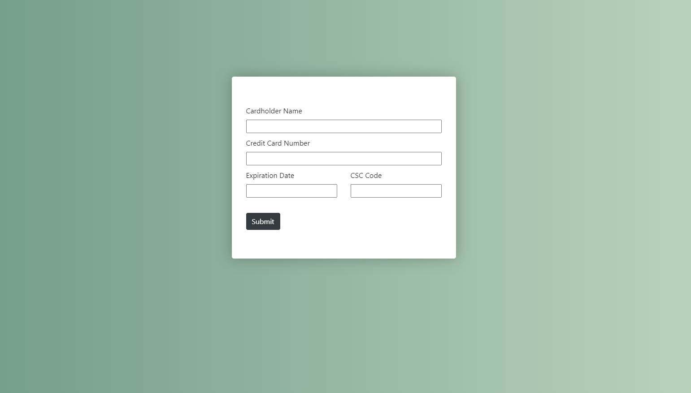

<h1 align="center">Daily UI Day 02: Credit Card Form</h1>

<p align="center">
This is a super simple credit card form for Daily UI's Day 02 challenge for the <a href="https://www.dailyui.co/"> 100 Days of UI 
challange.</a></p>


## Links

- [Repo](https://github.com/kelseychristensen/Daily-UI-Day-02-Repo "Daily UI Day 02 Repo")
- [Dribbble](https://dribbble.com/shots/19952876-Daily-UI-Day-02-Credit-Card-Form "Dribbble Link")

## Screenshots




## My process

### Built with

- HTML
- CSS
- Bootstrap
- Python
- Flask

### What I learned

I learned quite a few ways that do <i>not</i> accomplish giving users feedback about whether their inputs have been validated/accepted. I was determined to make this component using Flask so I could use what I know about Python to inject some code into the HTML and CSS, but to no avail. Since this is about practice, I ultimately decided to keep it simple after I had sunk some considerable time into the project.
### Continued development

I would definitely want to re-do this component so that it's more functional, including feedback when the input is accepted (like a green check mark) as well as some automatic formatting (e.g. dashes every 4 characters in the credit card field, a / between the month and year of the expiration). Ultimately, I fussed around too much with the Flask server to do something a little more effective!

I also, ultimately, did not use the Quickform capabilities of WTForm, instead adding each form element one-by-one to achieve the styling I wanted (chiefly, I was determined to have the CSC and expiration fields side-by-side). I would love to learn more about if WTForm poses any benefit doing it this way--perhaps that validators?--or would I have been better served by pure HTML? And, could I have gotten the styling I wanted making a Quickform?
```html
class Form(FlaskForm):
    name = StringField(label="Cardholder Name", validators=[DataRequired(), Email()])
    card = IntegerField(label="Credit Card Number", validators=[DataRequired(), Length(min=16, max=16)])
    expiration = DateField(label="Expiration Date", validators=[DataRequired(), Length(min=4, max=4)])
    csc = IntegerField(label="CSC Code", validators=[DataRequired(), Length(min=3, max=3)])
    submit = SubmitField(label="Submit")
```
```css
.jumbotron {
    height: 100%;
    background: white;
    filter: drop-shadow(0 0 1rem rgb(0,0,0,25%));
}
```


## Author

Kelsey Christensen

- [Profile](https://github.com/kelseychristensen "Kelsey Christensen")
- [Email](mailto:kelsey.c.christensen@gmail.com?subject=Hi "Hi!")
- [Dribble](https://dribbble.com/kelseychristensen "Hi!")
- [Website](http://kelseychristensen.com/ "Welcome")
